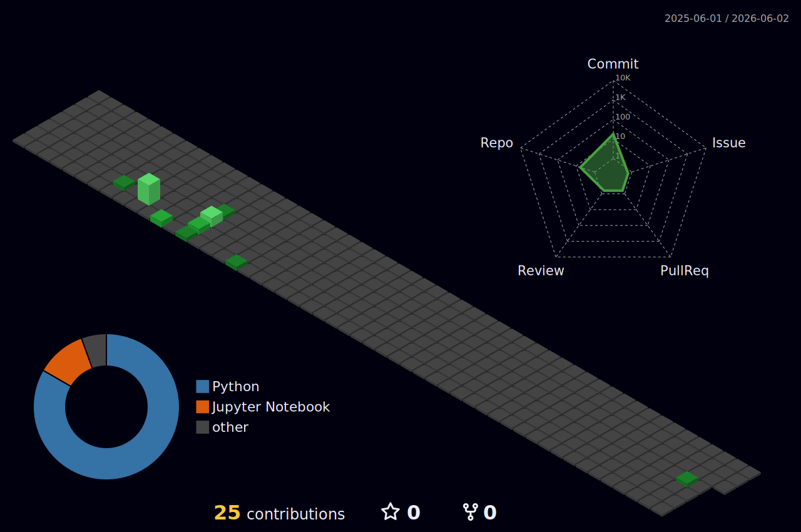

# Hi, I am Devaansh Makhijani 👋

### Agentic AI | Computer Vision | Autonomous UAVs

🚀 Building intelligent AI systems, multilingual agents, RAG pipelines, and autonomous drone solutions.

---

# 👨‍💻 About Me

I am a Computer Science undergraduate at Manipal University Jaipur with a strong focus on AI engineering, agentic systems, autonomous technologies, and real-world ML applications.

My work mainly revolves around building practical AI systems using LLMs, LangGraph workflows, Retrieval-Augmented Generation (RAG), vector databases, and MCP-based architectures. I enjoy combining research-oriented ideas with production-ready engineering.

Alongside AI, I am also actively working on autonomous UAV systems involving Pixhawk, ArduPilot, mission planning, telemetry workflows, and intelligent drone-based automation.

- 🔭 Currently building Agentic AI systems and Autonomous UAV solutions
- 🌱 Exploring advanced RAG pipelines, AI orchestration, and drone autonomy
- ⚡ Interested in AI infrastructure, intelligent agents, computer vision, and robotics
- 🛠️ Building production-ready backend systems using FastAPI, Docker, and vector databases
- 🚁 Working on autonomous drone workflows using Pixhawk and ArduPilot ecosystems

---

# 🧭 Areas I Work In

  
  
  
  
  
  
  

---

# 🧠 Tech Stack

## 🧩 Languages

  

---

## ⚙️ Frameworks & Libraries

  
   
   
  
  
  
  
  
  
  

---

## ☁️ Cloud, Databases & Tools

  
   
   
  
  
  
  

---

# 🚀 Featured Projects

## 🏥 Multilingual Healthcare Agentic Chatbot

Built a multilingual healthcare chatbot for rural India using LangGraph-based agent orchestration.

### Key Features
- 🌐 Multilingual support across Hindi, Tamil, Urdu, and English
- 🧠 Supervisor-agent architecture using LangGraph
- 🔍 RAG-powered contextual retrieval
- 🩺 MCP tools for symptom checking, nutrition guidance, exercise planning, and mental health support
- ⚡ Intelligent workflow routing based on user intent

---

## 📚 RAG API & Vector Retrieval System

Developed a complete Retrieval-Augmented Generation backend with vector search capabilities.

### Tech Used
- FastAPI
- Qdrant
- Docker
- MinIO
- Embedding pipelines

### Features
- Automated document ingestion
- Semantic chunking and embedding generation
- Vector similarity retrieval
- Production-ready Docker deployment
- Integrated as an MCP tool for AI agents

---

## ⚽ Custom MCP Football Data Server

Built a secure FastMCP-based microservice enabling LLM agents to retrieve football statistics and structured data through natural language workflows.

### Highlights
- Secure dual-key authentication system
- Dockerized deployment
- Modular tool architecture
- Optimized for AI agent interaction

---

## 🚁 Autonomous UAV System

Currently developing an autonomous UAV platform using Pixhawk and ArduPilot ecosystems.

### Focus Areas
- Autonomous waypoint navigation
- Mission planning workflows
- UAV telemetry systems
- Companion-computer communication
- AI-assisted drone automation
- Intelligent payload and control systems

---

# 💼 Experience

## 🏢 AI Intern — WittyBrains  
📅 June 2025 – August 2025

- Worked on Agentic AI systems and RAG pipelines
- Built intelligent workflows using LangChain, LangGraph, and MCP Servers
- Engineered backend systems with FastAPI and Docker
- Improved structured orchestration and contextual AI responses

---

## 🏢 Summer Intern — LetsAI  
📅 June 2024 – August 2024

- Implemented data optimization pipelines using Pandas and NumPy
- Automated business analytics workflows
- Improved operational efficiency through real-time AI-driven solutions

---

# 📜 Certifications

- AWS Academy Cloud Foundations
- AWS Cloud Security Foundations
- Oracle Cloud Infrastructure 2025 Certified Generative AI Professional
- Red Hat Certification in Operating Systems
- Oracle Academy OOP Certification

---

## 🚀 Github Insights

---

---

# 📫 Connect With Me

---

### 🔬 Building practical AI systems with real-world impact.

---

**🔬 Research-minded. 🧩 Product-aware. 🤝 Human about the work.**

